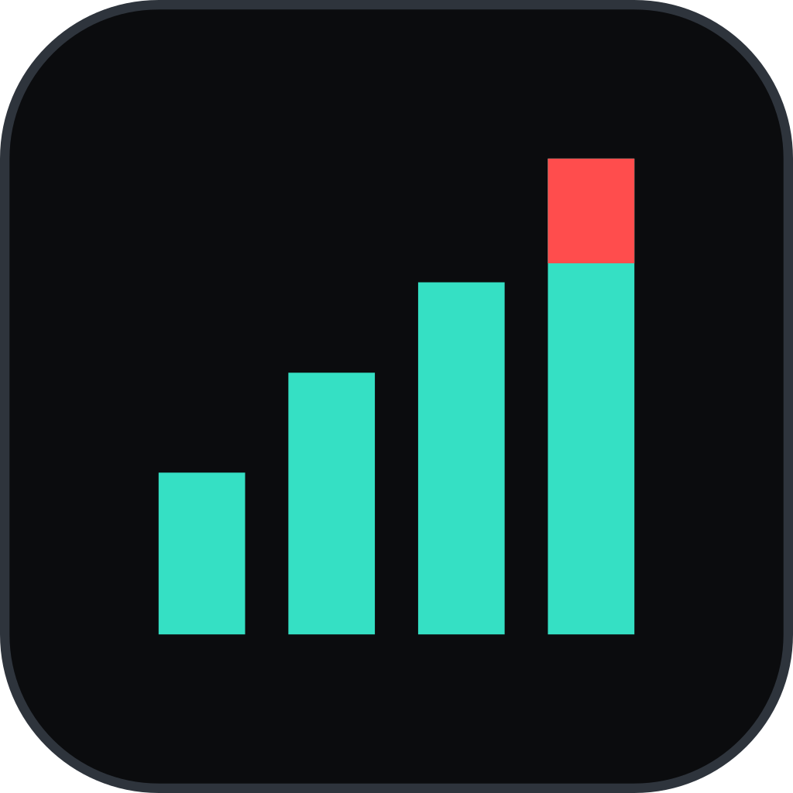

<div align="center">



<h1>Open Audio Analyzer</h1>

<p><strong>A free and open-source loudness and spectrum analyzer, for desktop and tablets.</strong></p>

<p>
  <a href="https://github.com/JonasGrunau/open_audio_analyzer/actions/workflows/ci.yml"></a>
  <a href="https://jonasgrunau.github.io/open_audio_analyzer/index.html"></a>
  <a href="#-the-correctness-gate"></a>
</p>

<p>
  
  <a href="#-licensing"></a>
</p>

<p>
  <a href="https://jonasgrunau.github.io/open_audio_analyzer/index.html"><strong>📖 Documentation</strong></a>
  ·
  <a href="https://github.com/JonasGrunau/open_audio_analyzer/releases">⬇️ Download</a>
  ·
  <a href="https://jonasgrunau.github.io/open_audio_analyzer/keyboard.html">⌨️ Keyboard</a>
  ·
  <a href="https://jonasgrunau.github.io/open_audio_analyzer/metrics.html">📐 Metrics</a>
  ·
  <a href="#-roadmap">🧭 Roadmap</a>
  ·
  <a href="#-known-gaps-stated-plainly">🚧 Known gaps</a>
</p>

</div>

Open Audio Analyzer is a modular metering suite: a canvas of resizable meter
modules — loudness, true peak, VU, spectrum, spectrogram, phase scope, histogram
— organised into tabs, driven by presets, delivery targets and skins, with
offline file analysis and a companion display that mirrors a tab to a tablet
over Wi-Fi.

It is a free reimplementation of the ideas in
[Decibel](https://process.audio/products/decibel) by process.audio, whose
modular canvas is the best interaction model anybody has found for this problem.
The measurement work, the architecture and the visual language are our own, and
where Open Audio Analyzer cannot honestly match Decibel it says so rather than
approximating.

---

## 📑 Contents

**📖 Documentation site** —
[Install](https://jonasgrunau.github.io/open_audio_analyzer/install.html) ·
[Keyboard](https://jonasgrunau.github.io/open_audio_analyzer/keyboard.html) ·
[Analysing files](https://jonasgrunau.github.io/open_audio_analyzer/analysing-files.html) ·
[Metrics](https://jonasgrunau.github.io/open_audio_analyzer/metrics.html) ·
[Wire protocol](https://jonasgrunau.github.io/open_audio_analyzer/wire.html) ·
[Changelog](https://jonasgrunau.github.io/open_audio_analyzer/changelog.html) ·
[Building](https://jonasgrunau.github.io/open_audio_analyzer/building.html)

**📄 This README** —
[✅ Status](#-status) ·
[📊 The fourteen modules](#-the-fourteen-modules) ·
[⚡ Why it is built this way](#-why-it-is-built-this-way) ·
[📐 Measurement](#-measurement) ·
[🧩 Layout](#-layout) ·
[📂 Configuration](#-configuration) ·
[🎨 Design](#-design) ·
[📦 Repository layout](#-repository-layout) ·
[📥 Installing](#-installing) ·
[🔨 Building](#-building) ·
[🔍 Analysing files](#-analysing-files) ·
[🎹 In a DAW](#-in-a-daw) ·
[🧭 Roadmap](#-roadmap) ·
[🚧 Known gaps](#-known-gaps-stated-plainly) ·
[🤝 Contributing](#-contributing) ·
[📜 License](#-license)

---

## ✅ Status

| | What ships today |
|:-:|---|
| 🎚️ | **All fourteen modules exist and measure something.** Open Audio Analyzer opens on a working meter bridge — loudness, super, digital, VU, validator, histogram, alert — with the analyser, oscilloscope, spectrogram, phase scope and stereo cloud on a second tab. |
| 🧩 | **The canvas is arrangeable**: add, move, resize, duplicate, delete, tabs, undo. |
| 📐 | **Loudness and true peak are verified** against the EBU Tech 3341/3342 cases, and the spectrum against a sine of known amplitude on a bin centre, on Linux, macOS and Windows on every push. |
| 💾 | **What you set up is remembered** — the layout, the delivery target, the skin and the capture device — and reopens with the window. Settings, presets, your own delivery targets and your own skins are plain JSON files in a documented directory; see [Configuration](#-configuration). |
| 🔍 | **Files are analysed offline** by the app and by the [`oaa` CLI](#-analysing-files). |
| 📱 | **A tablet [mirrors the canvas](#-roadmap)** over Wi-Fi. Flip **PUBLISH** in the desktop's status bar; the tablet finds it by itself, or reads a **pairing code** off its screen, or takes an address typed by hand — three routes, because the first one is what a venue's Wi-Fi blocks. |
| 🎛️ | **A headless [VST3 / AU plugin](#-in-a-daw)** meters what your DAW is playing. |
| 🔊 | **Your system's own output is metered with nothing to install** — WASAPI loopback on Windows, a Core Audio process tap on macOS 14.2+, a monitor source on Linux. No driver, and on macOS the audio still reaches your speakers while it is measured. |
| 📦 | **The installers carry the plugin and install it for you**, behind a checkbox that starts ticked — a macOS pkg, a Windows installer and a Linux tarball, plus an AppImage and a flatpak for the application alone. See [Installing](#-installing), and the [documentation site](https://jonasgrunau.github.io/open_audio_analyzer/index.html). |
| 🚧 | **What is *not* built** is listed under [Known gaps](#-known-gaps-stated-plainly), and the list is honest rather than short. |

See [Roadmap](#-roadmap), and [docs/PLAN.md](docs/PLAN.md) for the plan as it
was approved.

---

## 📊 The fourteen modules

Every one of them is [`ModuleFrame`](packages/oaa_ui/lib/src/module_frame.dart)
plus a painter, reads the same `MeterSource`, and repaints from the same clock.

| Module | What it shows |
|---|---|
| **Number Box** | Any single measurement, as a number. |
| **LUFS Meter** | Momentary and short-term loudness as bars, integrated loudness as a line. |
| **Super Meter** | Momentary, short-term and integrated loudness as three concentric arcs. |
| **Digital Meter** | Sample peak and RMS, per channel, up to 7.1. |
| **VU Meter** | A needle, on the movement the engine models. |
| **Alert Meter** | One measurement, watched, with the worst it has been latched. |
| **Validator** | The delivery decision, as a table. |
| **Histogram** | Loudness against time: how the programme moved, and when it was over target. |
| **Loudness Distribution** | How much of the programme was spent at each loudness. |
| **Spectrum Analyzer** | Level against frequency, log-spaced, with a peak hold. |
| **Spectrogram** | Frequency against time, with level as brightness. |
| **Oscilloscope** | The waveform itself, one lane per channel: triggered at scope speeds, rolling from half a second up. |
| **Phase Scope** | A goniometer: left against right, rotated so mono stands upright. |
| **Stereo Cloud** | Where each frequency sits in the stereo image, accumulated over time. |

---

## ⚡ Why it is built this way

A meter that stutters is not a meter. Everything below follows from one rule:

> [!IMPORTANT]
> **Measurements never cross an isolate boundary, never allocate per frame, and
> never rebuild a widget.**

Three tiers, and the boundary between each is deliberate:

| Tier | Thread | Job |
|---|---|---|
| 🎙️ **Capture** | audio callback, realtime-safe | Copy input into a lock-free ring. No malloc, no locks, no syscalls. |
| 🧮 **Analysis** | dedicated, high priority | Run the DSP graph. Publish results into a seqlock-protected snapshot. |
| 🖥️ **Display** | Flutter UI thread | One FFI call per frame, then paint. |

### ⏩ The per-frame path

Once per frame, [`MeterClock`](lib/src/clock/meter_clock.dart) makes a single
`@Native(isLeaf: true)` call to `oaa_snapshot_acquire` — an atomic load, a
memcpy, and a second atomic load, with no VM state transition. Then every
painter reads `Float32List` views that were **built once at startup** over
native memory that never moves.

The widget tree is not involved at any point. Painters are constructed with
`CustomPainter(repaint: clock)`, which re-rasters them *without rebuilding the
widget*. A frame costs one FFI call plus N `paint()` calls, and allocates
nothing.

Three consequences worth naming, because they are what usually goes wrong:

- **One clock, not fourteen.** Independent tickers drift, and two meters showing
  the same quantity could then disagree within a single frame. On a measurement
  tool that is a correctness bug, not a cosmetic one.
- **Measurements are consumed at the rate they are published; pixels are drawn
  at the rate you asked for.** The two are separate channels on that one clock.
  Dropping to 30 fps halves the rasterising and changes nothing about what the
  meters have seen — which matters because the engine's snapshot has one slot,
  so a measurement nobody reads in time is gone, and a display whose axis is
  time would have holes in it rather than a coarser picture.
- **Text is cached by formatted string.** A value changes continuously; the
  string rounded to one decimal changes about ten times a second. Laying out a
  `ui.Paragraph` on the other fifty frames is pure waste, so
  [`ReadoutPainter`](packages/oaa_ui/lib/src/readout.dart) rebuilds only when
  the string actually differs.
- **The reader retries, never the writer.** The snapshot is a seqlock precisely
  because it is wait-free for the analysis thread. A mutex would let a
  descheduled UI thread stall the thread that must never stall — and when that
  thread falls behind, the ring overruns and signal is lost for good.

### 🖌️ Rendering, per module

| Module | Technique |
|---|---|
| Number box, LUFS, Alert, Validator | Cached `ui.Paragraph`, rebuilt on string change only |
| Digital meter | Batched `drawRect`, one reused `Paint` |
| VU meter | Dial face pre-rendered once to a `ui.Image`; only the needle repaints |
| Spectrum analyzer | `drawRawPoints` over the native `Float32List` — C writes screen-space x,y directly. The drawn level is a one-pole average of the published bands, at the time constant its `Response` menu names; the peak-hold line above it never is |
| Phase scope | The last forty frames of samples in a ring, one `drawRawPoints` each at its age's brightness — the trail is the frames, not a faded picture |
| Stereo cloud | A decayed accumulator per two-pixel cell, emitted as points sorted into brightness buckets |
| Spectrogram | Run-length columns kept as data and redrawn every published frame, one `drawRawPoints` per palette step |
| Histogram | Ten columns a second into a fixed ring of loudness values, redrawn whole every frame as three `drawRawPoints`. Kept as measurements, not pixels, so it survives a resize |
| Loudness distribution | The engine's 120 published bins as one `drawRawPoints`, clipped twice so the bars either side of the target take different colours |

---

## 📐 Measurement

Correctness is the entire product, so every metric is pinned to a published
spec rather than to intuition.

| Quantity | Definition |
|---|---|
| **K-weighting** | ITU-R BS.1770-4 stage-1 shelf + stage-2 RLB, coefficients computed from the analog prototype **at the actual sample rate** — not hardcoded 48 kHz tables |
| **Gating** | EBU R128: 400 ms blocks at 75% overlap, absolute gate −70 LUFS, relative gate −10 LU |
| **Momentary / Short-term** | 400 ms / 3 s |
| **LRA** | Gated at −20 LU relative, 10th–95th percentile, via a 0.01 LU-bin histogram storing exact energy sums (O(1) per update, constant memory) |
| **True peak** | BS.1770-4 Annex 2, 4× oversampling with the specified 48-tap polyphase FIR, at every sample rate |
| **Spectrum** | 4096-point Hann window at a 1024-sample hop, zero-padded to a 16384-point transform and mapped onto 512 log-spaced bands with **peak-per-bin** so narrow peaks survive; bands too narrow to hold a bin read between two. Window-compensated: a full-scale sine reads 0.0 dBFS on a bin centre and within 0.3 dB off it |
| **Correlation** | Running Pearson over a sliding window |
| **Crest** | Sample peak minus RMS over the same block — the block's own values, not the held peak and smoothed RMS the meters draw, which settle at different rates and whose difference drifts on its own. Exactly 3.0103 dB for a sine, 0 for DC |
| **Clip** | Longest run of consecutive samples at or above 0.999 since the reset, per channel. Latched, so a clip that lasted three samples is still visible when you look back |

Every one of these is measured today and checked in CI, the spectrum included:
a full-scale sine on a bin centre reads 0.0 dBFS on every push.
`OAA_FLAG_SPECTRUM_UNAVAILABLE` stays in the ABI and consumers must keep
checking it, because a future source that cannot produce a spectrum needs a way
to say so — but this build never sets it.

### 🎯 On dynamics, and on honesty

Decibel reports a dynamics figure called *TrueDyn*. It is proprietary and
undocumented, so any claim to match it would be a guess presented as a
measurement. Open Audio Analyzer does not implement it.

Instead Open Audio Analyzer reports `DR-S` and `DR-I`, defined as `TruePeak −
LUFS-S` and `TruePeakMax − LUFS-I`, published in
[docs/METRICS.md](docs/METRICS.md) and reproducible from the definition by
anybody who wants to check. `PSR` and `PLR` are the same two quantities under
the names in wider use, and are offered as well — four names for two numbers,
each computed once so the pair cannot drift, and printed once in a report rather
than twice under different headings.

The same principle runs through the code. A quantity this build does not
measure is **NaN**, never zero — zero is a legitimate reading for correlation,
balance and several dB quantities, so it cannot double as "no data" — and the
UI renders it as an em dash. No quantity in the spec table above is unmeasured
in this build, so in practice a dash means a reading that is not yet *defined*:
momentary loudness needs 400 ms of signal, short-term needs 3 s, and integrated
needs one gating block above the absolute gate. Each shows a dash until it
means something. A remote display that has lost its host shows them too — a
frozen meter is indistinguishable from a quiet passage.

### ✅ The correctness gate

CI runs the **EBU Tech 3341 and 3342** cases on Linux, macOS and Windows on
every push, and fails the build if any reading is outside the standard's stated
tolerance. A loudness meter that has never been run against the reference cases
is a number generator.

The signals are **generated, not downloaded** — every case is a sine at a stated
level or a sequence of them, so the suite needs no fixtures, no network and no
WAV decoder, and each expected value is derived from the standard in a comment
rather than copied from somebody's output. Two extra properties are asserted
that the standard does not state but no correct implementation can violate:

- **Sample rate independence** — the same tone reads the same at 44.1, 48, 88.2,
  96 and 192 kHz. This catches the tempting shortcut of using the 48 kHz
  coefficient table BS.1770-4 prints instead of designing the filter at the
  stream's rate: it passes every 48 kHz test there is, and is wrong by a
  fraction of a dB on the most common delivery rate in music.
- **Block size independence** — ten seconds pushed in one call, in 512-frame
  device blocks, and in 377-frame chunks agree to 0.001 LU.

A third property is asserted now that there is a decoder: **decoding does not
change a reading.** A generated signal analysed directly, and the same signal
written to a WAV, decoded and analysed again, produce identical numbers to the
bit. That is the property offline analysis rests on, so it is asserted rather
than assumed.

> [!NOTE]
> The official **BS.2217 WAV vectors are still not used**, and the obstacle is
> no longer technical. The EBU and ITU test material is not licensed for
> redistribution here, and fetching it in CI would put a network dependency in
> front of the one suite that must never be flaky. Running them locally against
> `oaa` is worthwhile and is a one-liner; they are not a gate. See
> [docs/METRICS.md](docs/METRICS.md#conformance).

---

## 🧩 Layout

Open Audio Analyzer's canvas is a **24-column snapping grid** rather than
Decibel's free pixel positioning. 24 divides by 2, 3, 4, 6, 8 and 12, so halves,
thirds and quarters are all exact — a 12-column grid cannot express thirds and
quarters at once, which is the first thing anybody wants when arranging meters.

**The row count is fixed too, at 16.** The obvious alternative — square cells
and a canvas that scrolls — keeps module aspect ratios identical everywhere, and
is wrong: on a 32" display a cell becomes 160 px, a six-row meter becomes 960 px
tall, and a layout built on a laptop now needs scrolling. A meter bridge you
have to scroll is not a meter bridge. So both axes are fixed and cells are
whatever shape the window makes them, which costs nothing because every painter
has to handle arbitrary aspect anyway — nothing stops you resizing a phase scope
to 8×2.

The practical win is that a preset stores grid cells, so it is
screen-independent by construction. Decibel stores fractions of the window and
reconstitutes them per display; Open Audio Analyzer opens the same layout on a
32" monitor and an 11" tablet with nobody writing responsive code.

The interactions: **drag a module's title bar** to move it, **drag the corner
grip** to resize, **alt-drag** to duplicate, **right-click or long-press empty
canvas**
to add a module there, **right-click a module** for its options, and
**right-click or long-press a tab** to rename, duplicate or delete it. Buttons
for add, undo and redo sit in the tab strip as well, because tablets have
neither a right mouse button nor `⌘Z`.

A finger gets a larger target than the one that is drawn. The title bar accepts
a drag 40 px down from a module's top edge rather than the 24 px it paints, and
the corner grip accepts one from a 32 px square rather than a 16 px one — both
invisible, and both admitted to touch and stylus alone, so a mouse still moves
and resizes exactly what it can see. A cursor has a hotspot one pixel across and
says what it is over; a fingertip has neither.

Nothing on the canvas is a double click. A double-tap recogniser holds Flutter's
gesture arena for 300 ms before it gives up, and every button underneath one
waits that long to fire — which is a third of a second of an application that
feels broken, in exchange for a gesture a long press does better on both a mouse
and a tablet.

The one double click in the application is the window's own top edge on macOS,
where the status bar *is* the title bar: double-clicking it does whatever the
Mac's "double-click a window's title bar to" setting says, because a window that
ignores that gesture is a window that ignores the system. Flutter still
recognises nothing but a single click there — AppKit pairs them, in the runner,
which is also the only side that knows the interval this user set.

### ⌨️ Keyboard

Press `?` or `F1`, or the `?` in the status bar. Open Audio Analyzer draws its
own chrome and so has no menu bar, which is the usual place a desktop user reads
a shortcut off — without that sheet the shortcuts would be undiscoverable by
design.

`⌫` deletes the selection, arrow keys nudge it a cell and `⇧`+arrows resize it,
`⌘Z` / `⌘⇧Z` undo and redo, `⌘D` duplicates, `1`–`9` switch tabs, `⌘R` restarts
the measurement, `⌘O` analyses a file. The full list is on the
[documentation site](https://jonasgrunau.github.io/open_audio_analyzer/keyboard.html),
and it is not written twice: the page, the in-app sheet and the bindings
themselves all come from one table in `lib/src/app/shortcuts.dart`, and a test
fails if the page has drifted from it.

Three details that are decisions rather than defaults:

- **`Ctrl` and `⌘` are both accepted on every platform.** Asking the OS which
  one was meant is how a Mac driving an external PC keyboard ends up with no
  undo. Only the printed label is platform-specific.
- **A chord with no `Ctrl` or `⌘` stands aside while a text field has focus**,
  so a tab named `Mix 2` does not jump you to the second tab halfway through.
- **A nudge with nowhere to go does nothing**, rather than clamping. Clamping
  means the tenth press of `→` moves the module and the eleventh does not, with
  no way to feel where the edge was. It is the same rule a drag follows.

**Modules do not overlap, and a drop that would overlap is refused.** The two
alternatives are worse: allowing overlap turns a meter bridge into a stack of
half-hidden panels and needs a z-order, and pushing neighbours aside — what most
dashboard grids do — means a drag near an edge can rearrange a layout you spent
ten minutes on, irreversibly. Open Audio Analyzer shows the target cells while
the pointer is down — bright when the drop is legal, red when it is not — and an
illegal drop simply does not happen. Nothing moves that you did not move.

While the pointer is down the canvas becomes the placement grid: the cells are
ruled inside a border that sits one gutter outside the modules, and every module
except the one being carried is dimmed. A drop target is easy to place against
ruled cells and hard to find among a dozen meters that are all still moving.
The meters do not stop — dimming is a wash painted over them, not a pause, and
it is a wash rather than a blur because a full-screen blur would be re-computed
every frame over exactly the readings that are still arriving.

A module resized below its minimum shows `TOO SMALL` instead of an unreadable
smear — a spectrum analyser in two cells is not a small spectrum analyser. A
module kind that has no painter yet says `NOT BUILT YET` rather than showing an
empty panel, which would read as a meter that is broken.

**Presets, Calibrations and Skins** are three independent axes, as in Decibel,
including the `from preset` indirection. Null means *follow the preset*; a
concrete id means the user pinned that choice and browsing presets must leave it
alone. Without that distinction, either presets cannot carry a target or an
explicit choice gets silently overwritten.

Delivery targets ship as **data**, not code, so the set can be corrected and
extended without a release. Six are built in: **Streaming (−14 LUFS)** — which
is Spotify, Apple Music, YouTube, Amazon and Tidal, all of which normalise to
about the same place, so one target with their names in its note beats five
identical entries — plus **Spotify Loud**, **Podcast (−16 LUFS)**,
**EBU R 128**, **ATSC A/85** and **CD / no normalisation**. Anything else is a
JSON file you write; see [Configuration](#-configuration).

---

## 📂 Configuration

Everything Open Audio Analyzer remembers is a JSON file you can open, edit, copy
between machines or keep in version control.

| Platform | Directory |
|---|---|
| 🍎 **macOS** | `~/Library/Application Support/Open Audio Analyzer` |
| 🪟 **Windows** | `%APPDATA%\Open Audio Analyzer` |
| 🐧 **Linux** | `$XDG_CONFIG_HOME/oaa`, or `~/.config/oaa` |
| 📱 **iPadOS** | `Library/Application Support/Open Audio Analyzer` inside the app's own container |
| 🤖 **Android** | `oaa` inside the app's own `files` directory |

The two tablet rows are the ones you cannot open in a file manager, because both
systems give an app a private directory and no way out of it. Settings → Session
prints the path; a display persists its layout, its skin and the host it last
connected to, and nothing else on the device can read them. Android's directory
comes from `getFilesDir()` over a platform channel — nothing in the environment
there names a directory the app may write to — and it goes when the app is
uninstalled, as a tablet's copy of a layout should.

`OAA_CONFIG_DIR` overrides the three desktop rows — for a portable install, or
for keeping Open Audio Analyzer's configuration alongside your dotfiles — and
`--config-dir=<path>` on the command line beats the variable in turn, which is
the one that works on macOS where an environment cannot be handed to an
application bundle. Settings → Session prints the directory actually in use and
lets you select it, which beats retyping any of the above.

**The macOS app is deliberately not sandboxed**, and that is what makes the
first row true. A sandboxed app's `HOME` is redirected into
`~/Library/Containers/com.openaudioanalyzer.oaa/Data`, which would put your
presets somewhere you would never find them and stop either override from
pointing anywhere outside it — defeating the point of keeping configuration in
files you can edit, mail and version. The trade is that Open Audio Analyzer
cannot ship on the Mac App Store, which it was never going to; notarisation for
the installer package does not require the sandbox. See `macos/Runner/Release.entitlements`,
which says so at the top.

```
settings.json          the frame rate, source, target, skin
session.json           the canvas as you left it, saved as you work
presets/*.json         one file per saved layout
calibrations/*.json    one file per delivery target you wrote
skins/*.json           one file per skin
```

**One file per preset rather than one library file**, deliberately: it means a
preset can be sent to somebody or dropped in from a forum post, and that one
corrupt file costs one preset instead of all of them. Every write goes to a
temporary file and is renamed over the target, so an interrupted save leaves the
previous version intact rather than a half-written one. A file that fails to
parse is named in the interface and left alone — Open Audio Analyzer never
rewrites something it could not read.

The path this does *not* take is `path_provider`. That function needs a Flutter
binding, so it throws in the two places Open Audio Analyzer most needs these
paths — the `oaa` CLI and a unit test — and on macOS it returns a sandbox
container keyed by bundle identifier, which moves your entire configuration the
first time a build is signed differently.

### 🎨 Writing a skin

A skin names as many of thirteen colour **roles** as it likes and inherits the
rest, so changing one colour is a three-line file:

```json
{
  "id": "my-skin",
  "name": "My Skin",
  "colors": { "accent": "#FF9E00" }
}
```

The roles are `background`, `panel`, `panel_raised`, `hairline`,
`hairline_strong`, `text_primary`, `text_muted`, `text_faint`, `accent`, `warn`,
`over`, `meter_track` and `meter_fill`. Values take `#RGB`, `#RRGGBB` or
`#AARRGGBB`. Add `"light": true` for a palette that is dark ink on a light
ground.

They are *semantic* roles rather than literal colours — `over` is "the colour
that means over a limit", used for nothing else — which is what lets a skin
apply to a module written after it. Settings → Appearance → **Duplicate for
editing** writes the palette you are looking at out in full as a starting point,
and **Reload from disk** picks up your edits without a restart.

A delivery target is the same idea:

```json
{
  "id": "house-standard",
  "name": "House standard",
  "lufs_target": -12.0,
  "lufs_tolerance": 0.5,
  "true_peak_max": -1.0,
  "lra_max": 14.0,
  "vu_reference": -18.0
}
```

A file whose `id` matches one Open Audio Analyzer ships with **replaces** it
everywhere, including in presets that already name it — so if you disagree with
our reading of a published spec, your number wins. Delete the file and the
original comes back.

---

## 🎨 Design

**Precision Instrument.** Graphite black, one signal hue, hairline borders, no
shadows and no gradients. Depth comes from background steps, because
measurement gear is machined panels sitting flush, not floating cards.

```
bg      #0B0C0E     accent  #35E0C4   in spec
panel   #121417     warn    #F2B01E
hairline#1F2328     over    #FF4D4D
text    #E6E8EB / #8A9199 / #565E67
```

Two rules are enforced rather than merely encouraged:

1. **Every spatial value comes from `Space`** — `2, 4, 8, 12, 16, 24, 32, 48,
   64`. No widget writes a raw number for padding, margin or gap. Thirteen
   modules built over as many weeks drift apart one `EdgeInsets.all(11)` at a
   time, and the result reads as amateur long before anybody can say which
   value is wrong.
2. **Every number is monospaced with tabular figures.** With proportional
   digits a readout's width changes as its digits change, so it jitters while
   you watch it. It is the single most obvious tell of a meter written by
   somebody who does not use meters.

**Inter** (labels and prose) and **Google Sans Code** (every number) are bundled
rather than requested from the system, in the three and two weights the type
scale actually names. Falling through to the platform's own faces means digit
width, tracking and cap height all differ between macOS, Windows and Linux, and
a layout tuned on one is subtly wrong on the other two. Both are SIL OFL 1.1 and
their licences ship in `assets/fonts/`.

Every one of the fourteen modules is [`ModuleFrame`](packages/oaa_ui/lib/src/module_frame.dart)
plus a painter. That is the whole reuse strategy: a module that also owns its
own border and title treatment is a module that will drift from the other
eleven.

---

## 📦 Repository layout

```
engine/            C11 DSP core. Knows nothing about Dart or Flutter.        MIT
packages/
  oaa_engine/      FFI bindings + the build hook that compiles engine/.      MIT
  oaa_core/        Domain model. Pure Dart — no Flutter, no dart:ffi.        MIT
  oaa_wire/        The remote-display protocol. Pure Dart, no I/O.           MIT
  oaa_ui/          Design tokens and the primitives modules are built from.  GPL
lib/               The application.                                          GPL
assets/fonts/      Inter and Google Sans Code, with their licences.      SIL OFL
cli/               The `oaa` command-line analyser.                          GPL
plugin/            Headless VST3 + AU plugin.                              AGPL
  host/            A fake DAW that plays a file through it. Ships nowhere.  AGPL
docs/              PLAN.md, METRICS.md, WIRE.md.
```

`plugin/` is the one **AGPL** directory. JUCE 7 and 8 are AGPLv3-or-commercial —
only JUCE 6 offered GPLv3 — and Open Audio Analyzer takes the AGPLv3 option,
which is available because everything here is free software already. It changes
the licence of the plugin binary alone: the engine stays MIT, and the app stays
GPL because it never links JUCE. It talks to the plugin over a socket, which is
not linking. GPLv3 section 13 expressly permits the combination. Steinberg's
VST3 SDK, meanwhile, is now MIT and vendored inside JUCE, so there is no second
copyleft dependency and no SDK to check out.

Two boundaries carry weight:

- **`engine/` knows nothing about Flutter, and `oaa_core` knows nothing about
  `dart:ffi`.** Four things need the domain vocabulary — the app, the tablet
  display, the CLI and the plugin — and three of them have no engine of their
  own. The tablet reads measurements off a socket. The moment `oaa_core`
  imports `oaa_engine`, all three drag in a native library they never call.
- **One `liboaa` serves all three tiers.** That is what makes standalone,
  remote display and plugin tractable as one project rather than three.

### 📜 Licensing

Deliberately split, and set on day one because it is nearly free now and
expensive once outside contributors arrive:

- **`engine/`, `packages/oaa_engine`, `packages/oaa_core`, `packages/oaa_wire`
  — MIT.** A metering engine's value is that anyone can embed and audit it, and
  a measurement tool needs that scrutiny more than most software. The wire
  protocol is on this side of the line for the same reason: a third-party
  display should not have to be GPL to speak it.
- **`packages/oaa_ui`, `lib/`, `cli/` — GPL-3.0-or-later.** A free clone of a
  paid product should not be trivially re-closable.
- **`plugin/` — AGPL-3.0-or-later**, because it links JUCE. See above.

MIT is one-way compatible with GPL, so the combination composes cleanly.

---

## 📥 Installing

Every release publishes five desktop downloads and the CLI on the [releases
page](https://github.com/JonasGrunau/open_audio_analyzer/releases). The CLI is
an archive rather than one file — `bin/oaa` beside the engine as a shared
library — and needs no Flutter runtime either way.
Full instructions, including how to meter your own system's output on each
platform, are on the [documentation
site](https://jonasgrunau.github.io/open_audio_analyzer/install.html).

| | Platform | Artefact | Plugin | |
|:-:|---|---|:-:|---|
| 🍎 | macOS 11+ | `Open.Audio.Analyzer-<version>-macos.pkg` | VST3 + AU | Universal — Apple silicon and Intel. |
| 🪟 | Windows 10 1809+ | `Open.Audio.Analyzer-<version>-windows-x64.exe` | VST3 | Uninstaller in Installed apps. |
| 🐧 | Linux | `Open.Audio.Analyzer-<version>-linux-<arch>.tar.gz` | VST3 | `./install.sh`, no root. |
| 🐧 | Linux | `Open.Audio.Analyzer-<version>-<arch>.AppImage` | — | One file, no root, GTK from the host. |
| 🐧 | Linux | `Open.Audio.Analyzer-<version>-<arch>.flatpak` | — | Sandboxed, carries its own runtime. |
| ⌨️ | Any | `oaa-cli-<platform>.tar.gz` / `.zip` | — | The analyser. No Flutter runtime. |

> [!TIP]
> **The first three install the plugin as well, and the checkbox starts
> ticked.** Untick it and you get the application on its own. The AppImage and
> the flatpak cannot offer the choice at all: an AppImage never installs
> anything, and a flatpak's plugin would be built against the sandbox's
> libraries while the DAW that must load it runs against the host's.

> [!NOTE]
> **There is no Mac App Store build and there will not be one.** The store
> requires the app sandbox, and a sandboxed application has its home directory
> redirected into `~/Library/Containers` — which put every preset, skin and
> delivery target somewhere no user goes looking and no override could escape.
>
> Open Audio Analyzer is distributed directly instead. The pkg is signed with a
> Developer ID **Installer** certificate — a different one from the Developer ID
> Application certificate that signs the code, and not interchangeable with it —
> and notarised when a release is built with the credentials for both.
> `packaging/macos/make_pkg.sh` prints which of its three states it was in,
> because "signed" and "a user can double-click it" are not the same thing. See
> `macos/Runner/*.entitlements`, which carries the sandbox reasoning, and that
> script, which repeats it where somebody signing a build will be standing.

> [!NOTE]
> **The iPad build goes to TestFlight, and is not on the releases page.** A
> tagged release builds it, signs it for the App Store and uploads it — after
> the release is published, so a TestFlight build always belongs to a release
> that exists. The IPA is not attached as an asset because an App Store
> signature provisions no devices: a file you downloaded could not be installed
> on your iPad, by you or by anyone. Building it yourself is two lines in
> [Building](#-building) and needs no credentials at all.

The scripts that build these live in [`packaging/`](packaging/AGENTS.md), one
per artefact, and `ci.yml`'s packaging jobs run all five installers and the iPad
build on a tag and on demand — only the TestFlight upload waits for the
release. Each produces an unsigned artefact and says so rather than failing when
the signing secrets are absent — a fork has none, and a build that stopped there
would be useless to it.

---

## 🔨 Building

Requires Flutter `3.44.5-stable` (pinned in `.tool-versions`) and a C toolchain
— Xcode command line tools, MSVC, or gcc/clang.

```sh
flutter pub get
flutter run -d macos          # or windows, linux
flutter run -d <ipad>         # the display build; `flutter devices` names it
```

On iOS the engine is compiled as **Objective-C**, because miniaudio's Core Audio
backend is: it configures an `AVAudioSession` there, and iOS offers no C way to
do that. `hook/build.dart` handles it. This is worth knowing only because of how
it fails if it is ever undone — several hundred errors inside Apple's own
`Foundation` headers, not one of which names a file in Open Audio Analyzer.

Four Flutter plugins are pulled in: `desktop_drop` and `file_selector` to get a
path from a user, `flutter_riverpod` for configuration, and `mobile_scanner`
(MIT) for the host picker's QR scanner. The last is the one dependency here
with a native half that is not vendored, and the one that does not ship
everywhere — Android, iOS and macOS only. It integrates through Swift Package
Manager, so there is still no `Podfile` in this repository. The QR *encoder* on
the other side of that feature is written here rather than depended on:
`packages/oaa_ui/lib/src/qr.dart`, held against ZXing by `test/qr_test.dart`.

The app needs **no podspec, no `build.gradle` and no per-platform
`CMakeLists.txt`**. `packages/oaa_engine/hook/build.dart` compiles the C
through `native_toolchain_c` and bundles it as a code asset, which has been the
recommended way to ship native code with Flutter since 3.38. One build
description that works on five platforms beats five that each work on one.

`engine/CMakeLists.txt` describes the *same* compile for consumers that are not
Dart — the plugin, and a CI runner with no Flutter SDK. Two descriptions of one
compile is a real cost, paid deliberately: `plugin/test/sources_match.sh` fails
the build if the source lists drift apart, so **a new file in `engine/src` goes
in both.**

### 🧪 Tests

```sh
flutter analyze                       # lints, whole workspace
dart format --output=none --set-exit-if-changed .
                                      # formatting; nothing else objects to it
flutter test                          # widget and golden tests
dart test packages/oaa_core           # domain layer, no toolchain needed
dart test packages/oaa_wire           # the wire protocol, incl. the C++ golden
cd packages/oaa_engine && dart test   # engine, through FFI
cd cli && dart test                   # the `oaa` binary, as a subprocess
cd cli && dart build cli -o build     # and it still builds the way a release does
sh plugin/test/sources_match.sh       # the engine's two build lists agree
cmake -B plugin/build-nojuce -S plugin -DOAA_BUILD_PLUGIN=OFF && \
  cmake --build plugin/build-nojuce && \
  ctest --test-dir plugin/build-nojuce  # the plugin's C++ that needs no JUCE
cmake -B plugin/build -S plugin -DCMAKE_BUILD_TYPE=Release && \
  cmake --build plugin/build && \
  ctest --test-dir plugin/build       # the VST3, the AU and the fake DAW compile,
                                      # each macOS bundle verifies against its
                                      # own signature, and the plugin answers a
                                      # host that says nothing
dart test packages/oaa_wire           # again: with a built fake DAW the
                                      # end-to-end cases run instead of skipping
flutter test test/plugin_to_display_e2e_test.dart
                                      # and on to a display: DAW → plugin →
                                      # app → tablet
dart run tool/docs.dart               # the documentation site still builds
```

`dart test packages/oaa_wire` appears twice on purpose. Its end-to-end cases
spawn the [fake DAW](#-testing-the-plugin-without-a-daw) and decode what the
plugin sends over a real socket; without a build they skip, so the second run is
where they actually happen. Nothing there downloads anything — the test writes
its own signal.

`-DOAA_BUILD_PLUGIN=OFF` is the framework-free configure: no JUCE fetch, no
plugin, no fake DAW, and five seconds for the C++ tests that need none of them —
the transport box's delivered-exactly-once test and the wire golden's producing
half. It runs on every push; the full plugin build does not.

The line after the second `oaa_wire` run is the same run with the application in
the middle: the app's
plugin ingest accepts the plugin, its display host publishes what arrives, and a
display client reads it back the way a tablet does — so a DAW's meters are shown
to reach a second screen, field by field, rather than each half being shown to
work on its own. It skips without a built plugin too, and both want port 47822,
so neither runs while Open Audio Analyzer is open.

The engine tests are worth a look even if you never touch the C. A sine of
amplitude *A* has a peak of *A* and an RMS of *A*/√2 — exactly 3.0103 dB lower.
That is arithmetic, not convention, so the built-in test tone doubles as a
reference the meters can be held against on a headless CI runner with no sound
hardware anywhere near it.

---

## 🔍 Analysing files

Drop a file on the analysis panel, or run the CLI. Both decode the file and push
the blocks through the *same* `oaa_analyse` a capture device drives — there is
no second DSP path — so an offline reading and a live reading of the same audio
are identical rather than merely close. A test asserts exactly that, on the same
samples analysed both ways.

Nothing resamples or remixes: a file is measured at its own sample rate and
channel count, because a converter in front of a measurement changes the
measurement. WAV, AIFF, RF64, Wave64, FLAC and MP3.

```sh
oaa master.wav                                 # human-readable report
oaa --target streaming-14 master.wav           # …and a delivery verdict
oaa --format json --timeline master.wav        # every measurement, for scripts
oaa --format csv -o loudness.csv master.wav    # the loudness timeline
oaa --list-targets                             # what you can measure against
```

**`--target` reads your own targets too.** A `calibrations/*.json` file in the
[configuration directory](#-configuration) is available to the CLI exactly as it
is to the app, and one whose `id` matches a built-in replaces it — so a
correction to our reading of a published spec reaches the exit code and not only
the window. `--config-dir` points at somewhere other than the default.

**The exit code is the point.** With `--target`, a file that misses its delivery
spec exits `2`, an unreadable file exits `1`, and all-clear exits `0` — so a
release pipeline can fail a build on a master that is 2 LU too loud instead of
shipping it:

```sh
oaa --target streaming-14 master.wav || exit 1
```

Reports export as text, JSON and CSV. A quantity nobody measured is an em dash,
a `null` and an empty cell respectively — never a zero, which is a legitimate
reading for correlation and several dB quantities and so cannot double as
"no data".

The app adds a fourth: **a PNG report card**, for the message where somebody
asks whether the master is ready. It is drawn as a fixed layout rather than
captured from the panel, so it does not inherit a scroll position or a window
width and two people exporting the same report get the same picture. The CLI
does not render it — a pipeline reads the text, JSON or CSV.

---

## 🎹 In a DAW

Open Audio Analyzer installs as a **VST3** and an **Audio Unit** that draws
nothing.

Insert it on a track, a bus or the master, and the desktop app meters what your
DAW is playing — through the same engine, on the same canvas, with the same
painters as a live input. The plugin measures and streams; the app displays.
That split is not a compromise around Flutter's inability to be a plugin GUI, it
is what stops there being two implementations of every meter drifting apart from
each other.

The app takes the connection as the choice: a plugin that connects appears on the
canvas in place of whatever local source was there, the status bar names it, and
removing the plugin hands the canvas back. **RESET is the one control that
cannot follow.** Protocol version 3 opened the app → plugin direction, but it
defines one frame and RESET is not it, so nothing here can restart an
integration inside the plugin; pressing it while a plugin is on screen says so
rather than quietly resetting a local engine nobody is looking at.

```sh
cmake -B plugin/build -S plugin -G Ninja -DCMAKE_BUILD_TYPE=Release
cmake --build plugin/build
```

Products land in `plugin/build/OaaPlugin_artefacts/Release/`. Nothing is copied
into a system plugin folder unless you copy it — a build that installed itself
would mean the DAW you have open is now running a binary you did not knowingly
install. JUCE is fetched and pinned, not vendored, so a fresh clone builds
without checking out a framework by hand.

**Installing it.** This is the manual route, for a plugin you built or an
archive you unpacked — the macOS pkg, the Windows installer and the Linux
tarball do all of it for you, behind a checkbox that starts ticked. Copy the
*bundle*, not the directory holding it, into the folder your DAW scans. On a
machine that has never had a plugin installed, that folder does not exist yet:

```sh
# macOS
mkdir -p ~/Library/Audio/Plug-Ins/VST3 ~/Library/Audio/Plug-Ins/Components
cp -R "plugin/build/OaaPlugin_artefacts/Release/VST3/Open Audio Analyzer.vst3" \
      ~/Library/Audio/Plug-Ins/VST3/
cp -R "plugin/build/OaaPlugin_artefacts/Release/AU/Open Audio Analyzer.component" \
      ~/Library/Audio/Plug-Ins/Components/

# Linux
mkdir -p ~/.vst3
cp -R plugin/build/OaaPlugin_artefacts/Release/VST3/*.vst3 ~/.vst3/
```

On Windows the folder is `%CommonProgramFiles%\VST3`. **Ableton Live also has to
be told to look there** — Preferences → Plug-Ins → *Use VST3 Plug-In System
Folders*.

**If you unpacked a release archive on macOS, strip the quarantine flag.**
A browser marks every file it downloads, the mark survives extraction, and
Gatekeeper then refuses the load. On macOS 15 and later that refusal is a modal
saying the plugin cannot be verified free of malware, or that it will damage
your computer, **with no way to override it in System Settings** — the "Open
Anyway" button there is only ever offered for a blocked *launch*, and loading a
plugin into a DAW is a library load, so nothing appears for you to click. On
earlier versions it is silent instead, and the plugin is simply absent from the
DAW's browser with nothing logged anywhere. Either way:

```sh
xattr -dr com.apple.quarantine ~/Library/Audio/Plug-Ins/VST3/"Open Audio Analyzer.vst3"
```

The build signs each macOS bundle *after* every step that writes into it and
then verifies the result, so `codesign --verify --strict` and `auval` are both
clean. Signing is ad-hoc by default, and **ad-hoc is not a Developer ID**: only
the flag above gets an ad-hoc copy past Gatekeeper. Build it yourself and there
is no flag to remove. `-DOAA_CODESIGN_IDENTITY=<id>` signs with a real identity,
and `packaging/macos/notarize.sh` is what then gets a download past Gatekeeper
without the user doing anything — a signature on its own does not, which is the
step people skip.

The bundles are universal and load on **macOS 11 and later**. That is one
version above the application's own floor of 10.15, which is why the pkg greys
out its two plugin rows on Catalina rather than installing something that would
never load. Releases up to 0.5.0 were neither: CMake defaults both the
architecture and the deployment target to whatever machine did the build, so
the runner shipped an arm64-only bundle that no Intel Mac and no older macOS
could load — and a bundle whose slice does not match is, to a DAW, the same
event as a bundle that is not there.

The plugin connects to the app on `127.0.0.1:47822` and keeps retrying, so it
does not matter which of the two you start first. Its window is a status panel —
connected or not, sample rate, channel count, and whether the host is giving it
a playhead — and nothing else. Several inserts can be connected at once; the
most recently added is the one on screen, because adding it is the act of
choosing it.

**What the DAW adds that a live input cannot.** The host's transport comes
across with the audio: play and record state, the playhead in seconds, samples
and quarter-notes, tempo, time signature, loop points, and SMPTE timecode with
its frame rate — plus a flag when the playhead *jumps*, because an integrated
reading taken across a relocate is the average of two passes of the same music
and looks entirely reasonable.

The status bar reads it back: the position in the most precise unit the host
gave — timecode, else bar and beat, else the host's own clock — and the tempo
and time signature beside it where the window is wide enough to hold them. It is
drawn brighter while the transport is rolling than while it is parked, because
two readings of the same frame otherwise print the same string.

**And it reaches a tablet.** The desktop relays the playhead to every attached
remote display, so an iPad across the room shows the DAW's position beside the
DAW's meters — which is the point of having
one there. It is sent when it changes rather than with every measurement, so a
parked session costs nothing, and a display that attaches to one is given the
position it is parked at rather than waiting for somebody to press play.

The **Elapsed** and **Timecode** LUFS modes are what that measurement is for,
and **no module offers them yet**. Tying an integration window to the transport
means restarting it when the transport moves, which is a command travelling from
the app back to the plugin — and as of protocol version 3 that command exists.
The plugin applies the mode against the transport it captures per audio block
rather than being told when to reset, because the app only sees the playhead at
the publish rate and a reset arriving a frame late has already let the wrong
audio into the reading. What is missing is the menu to choose a mode in; see
[Known gaps](#-known-gaps-stated-plainly).

Hosts differ enormously in what they actually report, and Open Audio Analyzer
does not paper over it: every transport value carries a flag saying whether the
host supplied it, and a value that did not arrive is not drawn at all. A tempo
that arrives as zero is indistinguishable from a real one, and "bar 1, beat 1,
00:00:00:00" is a perfectly plausible thing to show somebody while their session
is parked at bar 57 — so a host that reports no tempo gets no tempo printed, and
one that reports no position at all gets dashes rather than a plausible zero.

That last case is one **no DAW can actually produce**, and it is worth knowing
why. Neither VST3 nor the Audio Unit API has a way to say "not saying": JUCE's
VST3 host sends a zeroed process context with no validity flags, the plugin's
wrapper reads a position back out of it unconditionally, and the Audio Unit
scopes a playhead around every render. A host that withholds its transport
therefore arrives as one *parked at zero with nothing else valid*, which is what
the plugin reports, because it is the correct reading of what the format
delivered. The dashes belong to the branch behind that, which the fake DAW
cannot reach either — so it is held by
[`plugin/test/transport_capture_test.cpp`](plugin/test/transport_capture_test.cpp),
which hosts the processor as the C++ object it is and asserts that both ways of
saying nothing publish nothing, and that the plugin's own status panel says so.

### 🧪 Testing the plugin without a DAW

`plugin/host/` builds a **fake DAW**: a host that plays an audio file through
the plugin and gives it a transport. It is built by the same CMake run.

```sh
open plugin/build/host/OaaFakeDaw_artefacts/Release/oaa-fake-daw.app  # macOS
plugin/build/host/OaaFakeDaw_artefacts/Release/oaa-fake-daw           # Linux
```

It finds the VST3 in the build tree beside it, so with the app already running
the only thing left is to open a track and press space. Tempo, time signature,
timecode frame rate, a loop region and the record flag are all controllable in
the window, and the plugin's own status panel opens in a second one.

Three more gestures are command-line switches, because they are the ones that
have to happen on cue rather than when somebody remembers: `--no-playhead`
reports no transport at all (the window has a checkbox for it too), and — in
`--headless` runs — `--parked` renders with the transport stopped, the state a
session spends most of its time in, while `--relocate-at=<s>` plays, stops,
jumps back to the start and plays again. That last one is the gesture
[`docs/WIRE.md`](docs/WIRE.md) names as the reason the discontinuity flag
exists.

`dart run tool/fetch_test_audio.dart` downloads music worth looking at: two
CC BY 3.0 post-rock tracks, picked by measuring candidates rather than by
reading titles. The default is a loud master with a real 10.3 LU range, a true
peak *above* its sample peak, and a stereo field that moves. A sine has none of
those — correlation pinned at 1.00, one spectrum bin, and an LRA of zero.

The same binary runs with `--headless`: no window, no sound card, blocks pushed
from a background thread. That is what
[`packages/oaa_wire/test/plugin_e2e_test.dart`](packages/oaa_wire/test/plugin_e2e_test.dart)
drives, and it is the only test that covers the live path — `prepareToPlay`, the
FIFO, the playhead, the engine, the streaming thread and the socket — rather
than the codec alone.

It earned its keep immediately: **six** findings that nothing else could see,
listed under **What it found** in
[`plugin/host/AGENTS.md`](plugin/host/AGENTS.md). Five were defects and all five
are fixed — three in the plugin's transport handling, one that only became
visible with the fake DAW and the application running as a pair (a check neither
test suite can be), and one in the fake DAW itself, which was inventing the very
thing it exists to measure. The sixth is not a defect: the plugin's "host
supplies no position" branch cannot be reached through *either* plugin format,
so neither a DAW nor the fake DAW can ask for it. It is held instead by
[`plugin/test/transport_capture_test.cpp`](plugin/test/transport_capture_test.cpp),
which hosts the processor with no format wrapper in the way — the only place
that branch exists.

---

## 🧭 Roadmap

| Phase | | Status |
|:-:|---|:-:|
| **0** | Skeleton, engine spike, the render path, design tokens | ✅ done |
| **1** | K-weighting, M/S/I, LRA, true peak, **EBU conformance in CI**, device capture | ✅ done |
| **2** | The 24×16 canvas: add, move, resize, duplicate, tabs, undo; bundled type | ✅ done |
| **3** | The twelve modules, the FFT, the scope and the loudness distribution | ✅ done |
| **4** | Presets, calibrations, skins, audio settings, persistence | ✅ done |
| **5** | Offline file analysis, report panel, exports, `oaa` CLI | ✅ done |
| **6** | Remote display: mDNS discovery, wire protocol, tablet mode | ✅ done² |
| **7** | VST3 and Audio Unit plugin, DAW transport and timecode | ✅ done¹ |
| **8** | Keyboard shortcuts, docs site, packaging (installers for all three desktops, AppImage, flatpak) | ✅ done³ |

¹ The plugin, the transport and the timecode ship. The **Elapsed and Timecode
LUFS modes do not** — see below.

² The display ships, and discovery now works on all five platforms.
**Tab-per-display targeting is not built** — see below.

³ All five installers build and are published on a tag. **None of them is signed
in this repository** — signing needs certificates that are not ours to commit,
so a release built from a fork is unsigned and every script says so. See
[Installing](#-installing).

### 🚧 Known gaps, stated plainly

- 🎛️ **No module offers the Elapsed or Timecode LUFS modes yet.** What used to
  block them is gone: the protocol needed a frame travelling from the app *to*
  the plugin, and protocol version 3 defines one — `0x0020 SET_LUFS_MODE`, on
  the ingest port only, which is loopback where whatever connects is already
  running as you. The engine's half is built too. What is left is the part you
  would see: a mode menu on the LUFS modules, and a region editor for Timecode,
  which is the change that closes this. **Continuous is what every module
  measures today**, and it is the mode a producer with no playhead can honour
  anyway.

  **RESET still cannot reach a connected plugin**, and that is now a smaller
  statement than it was: the direction exists, but version 3 defines only the
  mode frame and no reset frame, so `0x0021`–`0x002F` are still undefined.
  The remote display neither needs one nor will get one — the display port is on
  the LAN and stays read-only until somebody designs authentication for it.
  Silently restarting an integration mid-programme is wrong in a way nothing on
  screen reveals, which is not a capability to put on an unauthenticated port.
- 🔊 **Capturing your own system's output needs macOS below 14.2 to be
  worked around.** Everywhere else it now takes no setup at all, and there is
  no driver to install on any platform.
  - **Windows** — nothing to do. WASAPI loopback captures whatever is playing.
  - **macOS 14.2 and later** — nothing to do. **System Output** is the first
    entry in the source menu, named after the output device it is metering. It
    is a Core Audio process tap: it reads what is being sent to your speakers
    without rerouting it, so you keep hearing your audio, and the first time you
    choose it macOS may ask for permission to record system audio.
  - **macOS below 14.2** — the entry is absent, because the API is not there.
    Install [BlackHole](https://existential.audio/blackhole/) (free) or
    Loopback, route your output through it, and it appears in the source menu
    like any other input.
  - **Linux** — a PulseAudio or PipeWire monitor source already appears in the
    list.

  Metering a hardware input needs none of this — any interface shows up
  directly.

  Two rough edges on the macOS tap, both stated rather than hidden. It follows
  the default output device when you change it — headphones in, headphones out —
  but only when the new device has the same sample rate and channel count; the
  engine's DSP is sized once and cannot be resized underneath a running
  measurement, so a switch to a device with a different format stops the tap
  instead of following it. Reselecting the source picks the new device up. And
  if macOS denies the permission, a tap delivers silence rather than an error,
  which is indistinguishable from genuinely silent audio — if the meters sit at
  the floor with something obviously playing, check Privacy & Security.
- 📁 **Offline analysis does not read Ogg Vorbis, Opus, AAC or ALAC.** WAV,
  AIFF, RF64, Wave64, FLAC and MP3 cover the formats a master is delivered *as*,
  which is what a delivery check is for. The missing ones are what a master is
  distributed as after transcoding — worth having eventually, and the decoder is
  one function per format, but no measurement is silently wrong in the meantime:
  an unsupported file is refused rather than half-read.
- ⏱️ **A file is measured whole, from the start.** There is no region selection
  and no seeking during analysis, because an integrated loudness taken over a
  file that was seeked through is a measurement of a programme nobody played.
- 🔒 **The remote display has no authentication and no encryption.** Anyone who
  can reach the port can read the measurements and the layout — not the audio,
  which never goes on the wire. That is why publishing is **off until you switch
  it on**, and why the link is one-directional: a display cannot reset, retarget
  or reconfigure the machine it is watching. Do not switch it on at a venue
  whose Wi-Fi you do not control.
- 🌐 **Neither tablet's discovery can be proved by a test.** All five platforms
  find hosts by themselves now — the desktops and Android over a multicast
  socket Open Audio Analyzer owns, iPadOS through the system's Bonjour
  responder, because Apple does not let an app hold that socket without an
  entitlement it grants per developer on request. Android holds a
  `WifiManager.MulticastLock` while it searches, without which its Wi-Fi driver
  discards every answer below the socket and says nothing about it. What no
  suite can cover is whether the packets arrive: an Android emulator sits behind
  NAT that does not carry the LAN's multicast, an iOS simulator is exempt from
  the restriction the device enforces, and a `flutter test` on macOS is refused
  the local network for a reason that has nothing to do with the code. Both
  tablet paths are checked by hand on hardware, and the unit tests hold only
  what happens once a packet is in. What each end can do is say when it is not
  working, which is the whole difference between a feature that is off and one
  that is broken: the searching half has said so since Phase 8 and the
  advertising half now does too — a Mac refused local network permission
  announced nothing, reported nothing, and kept its port open the whole time.
  Typing an address is supported everywhere
  and always will be, because multicast is also the first thing a guest network
  blocks — and so, now, is pointing the tablet's camera at a code on the
  desktop's screen, which is the same address without the typing. That route
  needs a camera: Android, iPadOS and macOS have one through `mobile_scanner`,
  Windows and Linux have no implementation, and the row is absent there rather
  than present and refusing.
- 📡 **Publishing is never remembered, on purpose.** The display's name, port
  and update rate persist like every other setting — they are in Settings under
  **Publish** — but whether to publish does not, and starts off at every launch.
  The switch is **PUBLISH** in the status bar, deliberately not in the panel:
  an unauthenticated port that is open needs to be visible without opening
  anything. There is no password on that port, and a
  remembered "yes" means a laptop carried to a café starts advertising itself
  without anybody deciding to.
- 🖥️ **A remote display shows every tab, not a chosen one.** `TabSpec` carries a
  `displayTargetId` and nothing honours it yet: assigning tabs to a particular
  screen means the host has to be able to tell two displays apart, and in a
  protocol where the display says nothing at all, it cannot. Either the display
  identifies itself — which is a client→host frame, and the display port has
  none by policy rather than by limitation: the protocol has had one since
  version 3, on the ingest port, which is loopback — or
  the host keys assignments by address, which breaks on DHCP. Until then the
  display shows the whole preset and the viewer picks the tab.
- 📱 **Tablets are display-first.** FFI works fine on iPadOS and Android, but
  audio *input* selection differs sharply per platform. The tablet build's
  primary role is the remote display.
- 🔌 **Flutter cannot be a VST3/AU plugin GUI.** The plugin is a headless C++
  wrapper around the same `liboaa`, streaming measurements and DAW transport to
  the app over a local socket. It ships as **VST3 and Audio Unit** — the two
  formats that reach every DAW people actually master in. AAX is out of scope:
  it needs Avid's SDK and a registered developer account, neither of which a
  free project can promise.
- 🪟 **A light skin does not lighten the window frame on Windows or Linux.**
  Everything Open Audio Analyzer paints follows the skin; the window frame
  belongs to the operating system, and Flutter has no supported desktop API for
  it. macOS no longer has a title bar at all — the status bar runs to the top
  edge and the window buttons sit inside it — but that took platform code in the
  runner, and the other two each need their own.
- 🧪 **Native assets are young.** Recommended since Flutter 3.38, but the
  fallback if a platform misbehaves is the legacy `plugin_ffi` template plus
  CMake.

---

## 🤝 Contributing

Read [CLAUDE.md](CLAUDE.md) first — it is short, and it is where the rules that
are not obvious from the code live. Each directory has an `AGENTS.md`
explaining what belongs in it and why.

The house style for comments is *why, not what*, usually naming the failure mode
that forced the design. If a comment could be deleted without losing
information, delete it.

## 📜 License

GPL-3.0-or-later for the application; MIT for the engine and domain model. See
[Licensing](#-licensing) above and the `LICENSE` file in each tier.

---

<div align="center">


<p><sub>📖 <a href="https://jonasgrunau.github.io/open_audio_analyzer/index.html">jonasgrunau.github.io/open_audio_analyzer</a></sub></p>

</div>
